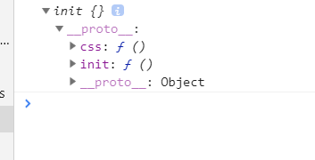

####jQuery源码学习一： 创建一个jquery实例
#####前言：
  jquery是每个前端都会的基础技能，众所周知，jquery返回的是jquery实例方法，但是我们似乎是直接使用$就可以获取到jquery的方法啦，可以在浏览器中判断一下 window.$ 和window.jQuery,jQuery 之间的关系，就会发现他们之间是全等的；
######不使用new方法调用
  我们一般调用实例大部分是通过new方法，但是jquery却不是，而是直接调用，这是为什么呢。
  1. 创建实例方法：

  ```
    (function(root){
      var jQuery = function(){
        console.log('创建实例啦')
      }
      root.jQuery = jQuery //这样赋值就可以调用啦
    })(window)
  ```
  2. 返回时操作
  但是现在页面上调用jQuery仍然不能使用$调用，于是简单修改代码

  ```
    (function(root){
      var jQuery = function(){
        return new jQuery()
      }
      root.$ = root.jQuery = jQuery
    })(this)
  ```
  这样我们就可以不在外部调用new方法，因为jQuery在返回的时候就已经调用了new
######原型共享
  在之前的操作下，我们已经将new jQuery返回了出去，但是这样是有问题的。我们在jquery原型中定义一个init方法，并将init返回出去
  1. 定义一个init

  ```
    var jQuery = function(){
      return new jQuery.prototype.init();
    }
    jQuery.prototype = {
      init: function(){
      }
    }
  ```
  但是这样我们虽然解决了报错问题，但是我们现在无法获取到jQuery中的原型方法，也就无法调用到jQuery的方法。
  2. 原型共享
  jQuery中有很重要的一行代码：

  ```
    jQuery.prototype.init.prototype = jQuery.prototype
  ```
  这就是原型共享，简单从代码来看，就是将jquery的原型赋值给jquery.prototype.init方法原型；
  这样我们调用jquery时，虽然获取的是init方法，但是依然可以调用jquery中的原型方法。
  3. 例子
  我们在jquery上简单扩展方法，并打印jquery验证

  ```
    jQuery.prototype = {
      init: function(){
      },
      css: function(){},
    }
  ```
  结果：
  