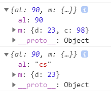

## jQuery源码二之extend的实现
extend是jQuery中一个比较核心的代码，如果有查看jQuery的源码的话，就会发现jQuery在多处调用了extend方法。
#### 作用
  1. 对任意对象进行扩展
  2. 扩展某个实例对象
  3. 对jquery本身的实例方法进行扩展

#### 实现
##### 基础版本， 对简单对象进行扩展
 ```
    jQuery.prototype.extend = jQuery.extend = function(){
      var target = arguments[0] || {}; //获取第一个参数作为目标结果
      var i = 1; //设置开始扩展的下标，扩展时第一个参数不会进行改变，不需要遍历
      var length = arguments.length;
      var option;
      if(typeof target !== 'object') {
        target = {};
      }

      for(; i< length; i++){
        option = arguments[i]
        for(var name in option){
          target[name] = option[name]
        }
      }
      return target
    }

    //调用
    var i = {a: 0};
    var b = {c: 9};
    console.log($().extend(i,b)) // {a:0, c:9}
  ```

##### 升级版本1.0， 对复杂对象进行扩展。
  在上面，我们已经写出的extend的基础版本，但是如果我们简单测试一下，就会发现仍是有问题存在的。
  我们可以使用上面的方法，对下面的对象进行扩展
```
      var n = {
        al: 90,
        m: {
          d: 23,
        }
      }
      var b = {m:{
        c: 98
      }};
      console.log($().extend(n,b)) // {al: 90, m: { c: 98 }}
```
 简单的从结果来看，返回的结果并不符合我们的预期，基础版本的方法似乎只是简单的值替换而已。那么来简单升级一下代码吧。
 在升级代码之前，需要了解一下关于浅拷贝和深拷贝的相关。
 ###### 关于浅拷贝和深拷贝的那些事
 1. 浅拷贝，
    对于浅拷贝，我的简单理解就是： 浅拷贝就是对最表面的层级进行拷贝，如果某一被拷贝对象的值发生了改变，最终的拷贝结果也会随之发生改变。
  ```
        var i = {a: 0};
        var b = {c: 9};
        console.log($().extend(i,b)) // {a: 90, c:9}
        i.a = 90
  ```
 2. 深拷贝，深拷贝主要的是面对复杂对象，如果浅拷贝是对最表面的一层进行拷贝，那么深拷贝就是，对拷贝对象的每一个层级都进行拷贝，某种层面来说，勉强算得上是递归的浅拷贝吧，但是比较不同的是，深拷贝中，如果某一个被拷贝对象的值发生了改变，拷贝结果是不会随之发生变化的，是一个独立的存储空间。
 ```
    var n = {
      al: 90,
      m: {
        d: 23,
      }
    }
    var b = {m:{
      c: 98
    }};
    console.log($().extend(true,{},n,b))
    console.log(n)
    n.al = "cs"
 ```
 结果：
  
###### 深拷贝extend代码扩展
 jQuery.extend是提供深拷贝的，需要将第一参数传为true。
 基本思路:
   1. 首先先对第一个传入参数进行判断，判断是否是boolean类型,来决定是否需要进行深拷贝;
   ```
      var deep = false;
      if (typeof target === 'boolean') {
        deep = target;
        target = arguments[1];
        i = 2;  //因为第一参数为boolean,所以拷贝对象从argument[1]开始，但通常第一个拷贝对象是不需要比遍历的，所以遍历下标从2开始。
      }
   ```
   2. 对需要遍历的对象进行判断，判断是否是复杂类型。使用extend对jquery进行扩展。
   ```
      if (length === 1) { //此时extend参数只有一个，但是目标应该是this,所以获取到this;
        target = this;  //但同时 i = 1;无法进行遍历，所以将遍历下标后退一位
        i--;
      }

      jQuery.extend({
        isArray: function(obj) {
          return toString.call(obj) === '[object Array]';
        },
        isPainObj: function(obj) {
          return toString.call(obj) === '[object Object]';
        }
      })
   ```
   3. extend方法改造。
   ```
      jQuery.prototype.extend = jQuery.extend = function(){
        var target = arguments[0] || {};
        var i = 1;
        var length = arguments.length;
        var option, copy, src, copyisArray, clone;
        for(; i< length; i++){
          if((option = arguments[i]) != null ){
            for(name in option) {
              src = target[name];
              copy = option[name];
              if(jQuery.isPainObj(copy) || (copyisArray = jQuery.isArray(copy))) {
                if(copyisArray) {
                  copyisArray = false;
                  clone = src && jQuery.isArray(src) ? src : [];
                } else {
                  clone = src && jQuery.isPainObj(src) ? src : {};
                }
                target[name] = jQuery.extend(clone,copy)
              } else if(copy !== undefined) {
                target[name] = copy
              }
            }
          }
        }
        return target
      }
   ```
   行了，到这里为止，我们就已经完成了简单的extend函数了，其实比较重要的是深拷贝和浅拷贝，关于这一点，下次再记录吧。
