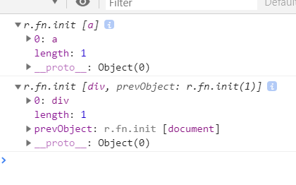
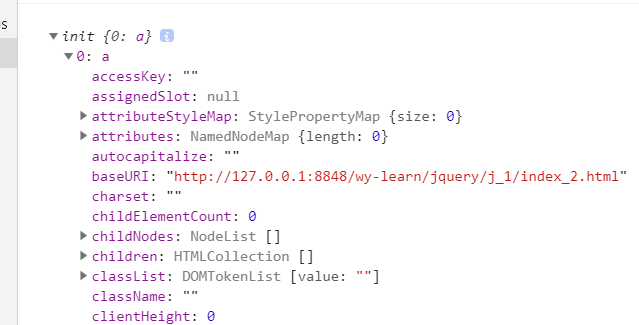
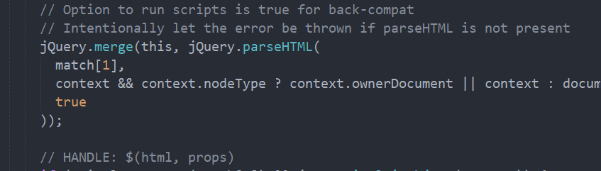
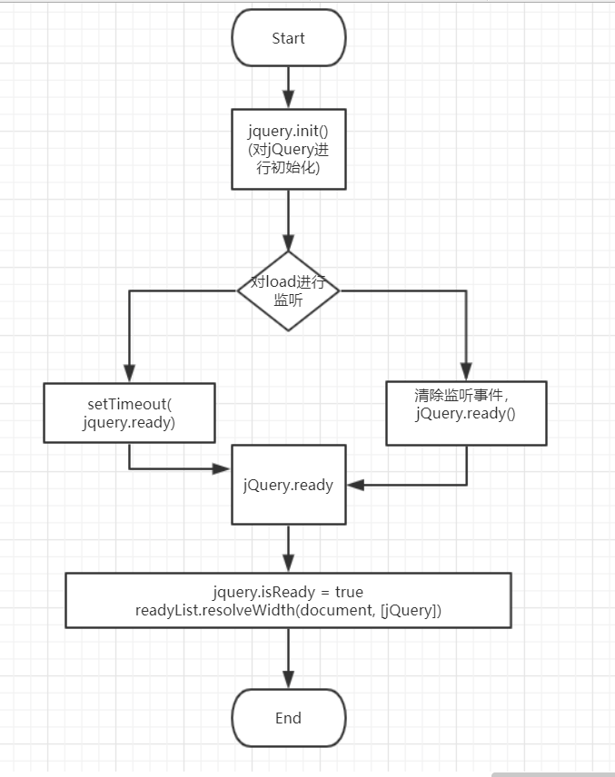

## jQuery（三）之 选择器(基础版)
对于jQuery的调用，我们一般都会传入参数
```
  html: <div></div>
  js: console.log($('<a />'));
    console.log($('div'));
```

##### 前置（DOM对象和jQuery对象）
  1. DOM对象，
    关于这个，应该是前端的基础知识了，在文档对象模型中，每个部分都是节点。
  2. jQuery对象
    这个是指通过jQuery构造函数创建出来的对象，可以通过jQuery选择器获取到，并以类数组的形式保存在jQuery中

##### 实践
  仔细观察返回的jQuery对象，感觉像是对DOM节点进行封装，并将其保存在jQuery上
###### 实现一个基本的创建选择器
  基本获取思路：
   1. 获取到传入参数，判断是创建一个jquery节点，还是查询节点，
   2. 创建新节点，传入的是一个html标签，以此进行判断
```
      //获取到传入的参数
      var jQuery = function(selector, content) {
        return new jQuery.prototype.init(selector, content);
      }
      jQuery.prototype = {
          length: 0,
          init: function(selector, content) {
            content = content || document;
            var match; //match 用来保存selector;
            if(typeof selector === 'string') {
              // 判断selector传入的是一个html标签；
              if(selector.charAt(0) === '<' &&& selector.charAt(selector.length-1) === '>' && selector.length >= 3 ) {
                match = [selector];
              }
              if (match) {
                //创建一个jQuery对象。
              }
            }
          }
      }
```
   3. 确定好是需要创建一个节点之后，我们就需要思考需要进行什么操作。需要将标签名解析出来，然后利用createElement创建节点，并保存。
      * 定义一个html解析函数
```
      var reg = /^<(\w+)\s*\/?>(?:<\/\1>|)$/;
      jQuery.extend({
            parseHtml: function(data, content) {
              if (!data && typeof data != 'string') {
                return null;
              }
              var parse = reg.exec(data);
              return [content.createElement(parse[1])] //ok,这里是将创建的一整个DOM节点保存在了数组中。
            }
      })
```
      * 已经可以获取到创建的节点了，下面将节点挂载在jQuery上就可以了。
```
      if(match) {
            for(; i < match.length; i++) {
              var opt = match[i]
              this[i]=jQuery.parseHtml(opt, content)[i]
            }
      }
```
好了，现在我们就可以看下代码的执行结果了。
    
ok,勉强可以实现，但好像还是有点不对的样子， 让我们来看下jQuery的源码。

可以看出是调用了merge方法。跳转到merge方法查看一下,一般来说，merge用于合并两个数组, 也可以用于将数组合并在<font color="#e06c60">有length属性的对象</font>上。
  ```
      // push.apply(_, arraylike) throws on ancient WebKit
      merge: function (first, second) {
          var len = +second.length,
            j = 0,
            i = first.length;
          for (; j < len; j++) {
            first[i++] = second[j];
          }
          first.length = i;   
          return first;
      }
  ```
了解的区别后，我们来优化代码吧，
   4. 优化    

###### 实现一个基本的标签选择器
   1. DOM原生节点查询
      * document.querySelector
      * document.querySelectorAll //返回一个NodeList
   2. 实践
    利用document原生查取节点的方式，获得结果，再将其每一个放在jQuery上
 ```
      var ele, i = 0;
      if(match) {}
      else {
          ele = document.querySelectorALL(selector);
          for(; i < ele.length; i++) {
            this[i] = ele[i]
          }
          this.length = ele.length;
      }
 ```

###### 关于传入一个方法的选择器
  1. 首先看下init中是如何处理的：
  ```
    var rootjQuery;
    init = jQuery.fn.init = function(selector, context, root) {
      ...
      root = root || rootjQuery;
      if(typeof selector === 'string') {
        ...
      } else if (isFunction(selector)) {
        return root.ready !== undefined ? root.ready(selector) : selector(jQuery);
      }
    }
    rootjQuery = jQuery(document);
  ```
    代码可以看出，其实js是可以传递三个参数的，且root默认为document，如果root.ready没有初始话的话就立刻执行传入的方法，否则调用root.ready方法。关于root,从代码可以看出，是个全局，那么root.ready == jQuery.ready。
  2. 在看ready方法前，需要明确一个问题，jquery传入方法的处理是在文档加载之后执行，所以首先应该对文档是否加载完毕进行判断。
  ```
      function completed() {
        document.removeEventListener('DOMContentLoaded',completed);
        window.removeEventListener('load', completed);
        jQuery.ready();
      }
      
      if(document.readyState === 'complete' || (document.readyState !== "loading" && !document.documentElement.doScroll)) {
        window.setTimeout(jQuery.ready);
      } else {
        //dom加载完毕后，调用complate移除监听事件。
        document.addEventListener('DOMContentLoaded', complete);
        window.addEventListener('load', completed);
      }
  ```
  3. 可以看下jQuery.ready方法了。
  ```
    jQuery.extend({
      // DOM是否已经准备好要使用了，发生更改，则修改为true;
      isReady: false,
      //跟踪就绪事件触发前要等待的项目数计数器
      readyWait: 1,
      ready: function(wait) {
        if(wait === true ? --jQuery.readyWait : jQuery.isReady) {
          return ;
        }
        //DOM节点已经准备好了
        jQuery.isReady = true;
        
        if(wait !== true && --jQuery.readyWait > 0) {
          return 
        }
        //如果有函数绑定，立即执行。
        readyList.resolveWidth(document, [jQuery])
      }
    })
  ```
    从2.的时候可以看出，在DOM节点加载完的时候，调用了一次ready,此时没有传入wait,ready中第一个判断直接跳过，记录jQuery.isReady = true,然后再看下一句执行，调用readyList.resolveWidth方法，此时DOM节点已经加载完毕，可以执行绑定的函数了，
    关于这个readyList是什么，我们在代码中找一下看下，
  ```
    var readyList = jQuery.Deferred();
    jQuery.fn.ready = function(fn) {
      ready.then(fn).catch(error) {
        jQuery.readyException(error);
      }
      return this;
    }
  ```
    从以上代码可以看出，readyList是Deferred函数的返回值，且从下面的调用，可以推测Defferred函数应该是个promise对象。对于Defferred函数，下次再仔细研究一下。
    现在让我们来回顾整个函数流程：
  ;
  上面的内容只是我自己的理解，如果有什么不对的地方，希望大家帮忙指出啊！