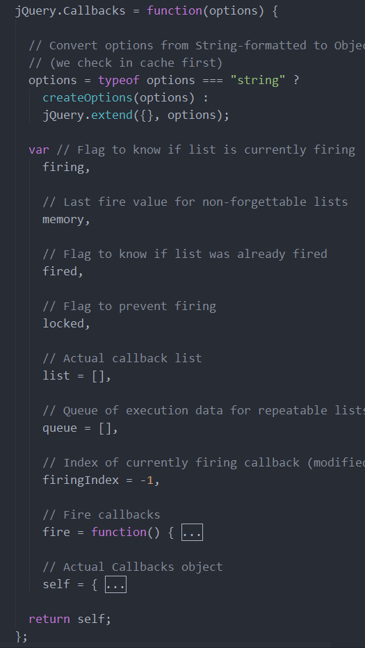

## jQuery(四)： CallBacks
#### 基本
   $.CallBacks() 是一个多用途的回调函数列表，用来管理函数队列，主要用于jQuery内部使用，
   params:
   ```
      1. once  //回调函数只执行一次
      2. memory //对上一次的参数进行缓存，调用时使用上次缓存的参数调用回调
      3. unique //保证添加的回调函数的唯一性
      4. stopOnFalse //某回调返回False后之后的回调都不予执行
   ```

   Api:
   ```
      1. add() //添加函数队列
      2. fire() //依次执行函数队列
   ```
#### 实现
##### 1.0
   ```
        jQuery.callbacks = function(option) {
            var list = [];
            var _this = {
              add: function() {
                //将add的参数转化为array,遍历存储
                var args = Array.prototype.slice.call(arguments);
                args.forEach(function(fn){
                  if(jQuery.isFunction(fn)) {
                    list.push(fn);
                  }
                })
                return this;
              },
              fire: function() {
                list.forEach(function(fn){
                  fn();
                })
              }
            }
            return _this;
        }
   ```
   这些代码，勉强可以完成使用callbacks的基本功能，但是现在传递参数的话，好像没啥用啊。
   下面来看下jq的源码：
   
   简单从源码来看，callbacks函数是个工厂模式，最后将self对象进行返回,然后来仔细看下其中的add,fire方法。
   * self.add： add方法本质上是获取到传递的参数，通过遍历，将方法存储起来
   * self.fire: self.fire通过调用self.fireWith再调用fire方法，完成对传入参数的调用。其中比较重要的fire私有方法，而关于self.fireWith是用来绑定上下文。
  ```
    // fire

    fire = function (data) {
      // 如果传入参数为memory,则记录data
      memory = options.memory && data;
      index = 0;
      length = list.length;
      start = 0;
      testting = true ; //触发回调标记
      for(; index < length ;index++) {
        // 通过apply()调用函数，并当参数为stopOnFalse时，直接跳出。
        if(list[index].apply(data[0], data[1]) === false && options.stopOnFalse) {
          break;
        }
      }
    }
  ```

##### 1.1 once
  once是只会调用一次的，可以设置一个标志，在第一次调用时改变值，并判断当前参数的值。
  ```
      var flag = false;
      var fire = function() {
        flag = true;
        list.forEach(function(fn){
          fn();
        })
      }
      ...
     fire: function() {
       if(!flag || option != "once") {
         fire();
       }
     }
  ```

##### 1.2 memory
  memory对上一次的参数进行缓存，再次使用add添加的时候直接调用；所以memory时应该是在self.add调用了fire方法。
  ```
    //对传入的参数进行类型判断，如果在缓存中，则直接调取缓存中的， 否则就创建一个；
    option = typeof option === 'string' ? (optionCash[option] || createOption(option)) : {};
    // 重点代码
    var memory;
    var fire = function(data) {
      memory = option.memory && data; //如果options.memory === true,就将data赋值给memory;
    }
    var _this = {
      add: function() {
        ...
        if(memory) {fire(memory)};
      }
    }
  ```
关于callback就简单写到这里，我觉得这篇文章可以给大家更好的学习一下callbacks方法：https://www.cnblogs.com/aaronjs/p/3342344.html