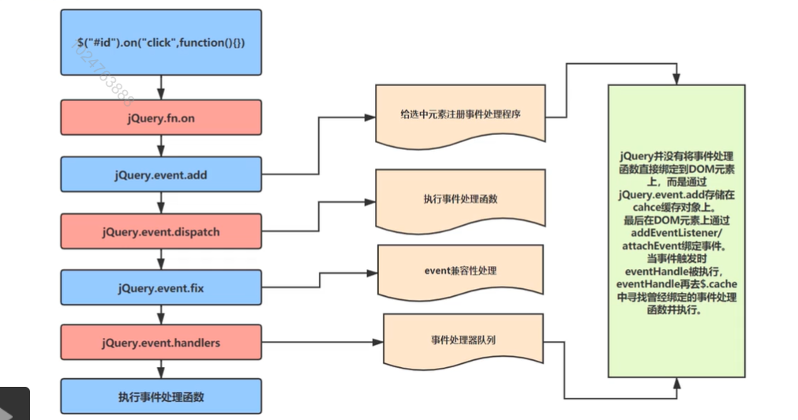

## jQuery(六) 事件绑定
  事件处理机制是一个比较重要的部分，下面先来了解些基础。
##### DOM0级和DOM2级
  我是第一次有了解到DOM0级和DOM2级的这个概念的，简单介绍下
  1. DOM0级
   将一个函数赋值给一个事件处理属性（如onclick），通过js指定方法处理程序的传统方法，简单来说，就是将事件写在html标签里，作为一个属性传入

      ```
        例子：
          <div onclick="click"></div>
      ```

  2. DOM2级
   通过事件监听的方法进行添加和移除事件： addEventListener() && removeEventListener(),
   同时，还添加了事件模型的概念，在DOM2中，事件流有3个阶段： 事件捕获， 处于目标阶段， 事件冒泡。
   我们都了解事件捕获阶段的整个流程是document -> parent -> target 这样逐渐深入的，而冒泡则恰好相反，像涟漪一样外推的
   所以整个事件流是这样的一个过程

    

##### jQ中的事件绑定
###### API
  1. bind: 为<font color="#D86658">被选元素</font>添加一个或多个事件处理和事件处理函数
  2. delegate: 为<font color="#D86658">被选元素的子元素</font>添加事件和执行方法
  3. on: 为<font color="#D86658">被选元素和被选元素的子元素</font>添加事件和执行方法

###### 原型
   
###### 流程
  1. on: jQuery的on方法是基础入口，

##### trigger自定义事件
  重点： 1. 模拟事件对象，触发浏览器默认行为
        2. 模拟事件冒泡
```
  ([][[]]+[])[+!![]]+([]+{})[!+[]+!![]]
  拆箱，装箱机制
  1.toString()
  js语法下：
    数字直接量，10进，2，8，16
    10进下： 小数点不可同时省略前后
  .运算 提供装箱操作，临时创建一个对象
  1 .toString() ==> new Number(1).toString();
 装箱： 将基本类型转换为引用类型
 拆箱：对象类型 => 基本类型
 js-隐式转换规则：
  当对象是string，或是复杂类型时
  1. 如果有一个对象是string,则将另一个对象转换为string,然后进行字符串拼接
  2. 如果两个对象都是复杂类型(Object{} || Array[])均需要转换为字符串，再进行拼接
  当对象是其他时
  会先转换为Number类型再进行
  空对象和空数组转化为Boolean是true
 ([][[]]+[])[+!![]]+([]+{})[!+[]+!![]]
  1. ([][[]]+[])
  2. [+!![]]
  3. ([]+{})
  4. [!+[]+!![]]

  /----------------/
  1.
  [] ==> [] (array)
  [[]] ==> [array] (array);
  [[]] + [] ==> String([[]]) + String([]) ===> "" + "" ==> ""
  [][[]] ==> [] ==> array ==> var ir = []
             [] ==> array ==> var ite = []
        ===> ir[ite] ==> "undefined"
  [][[]]+[] ==> String(undefined) + String("") ==> "undefined";

  /-------------------/
  2.
  关于js中的!! : 一般简单认为是双重否定，但其实应该是强制将对象转换为Boolean类型
  !![] ==> true
  [+!![]] ==> [+true] ==> [+Number(true)] ==> [1]


  /-------------------/
  3. ([]+{}) ==> (String([]) + String({})) ==> "" + "[object Object]" ==> "[object Object]"

  /--------/
  4.
  !+[] ==> !+"" ==> !"" ==> true
  !![] ==> true
  !+[]+!![] ==> 1+Number[true] ==>2

  所以综上： ("undefined")[1]+ "[object Object]"[2] =>"undefined"[1]+ "b" ==> "nb";
```

动画设计
1. 队列
  * Queue : jQ内部基础设施，仅供动画使用， 重度依赖data函数进行存储,
2. dom缓存数据？
  ```
    一般： <div id="app" key="value"/>
    JQ: data缓存 (允许在Dom上添加任意类型的数据，进行缓存)
    $("#app").data("name","")
  ```