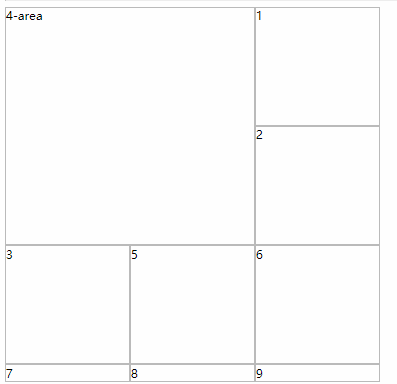
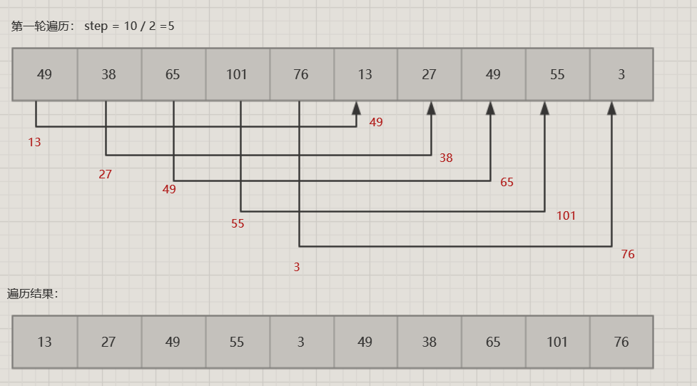
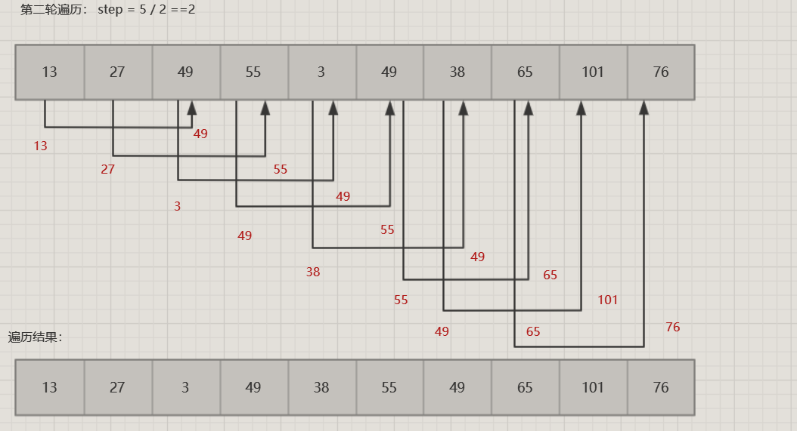
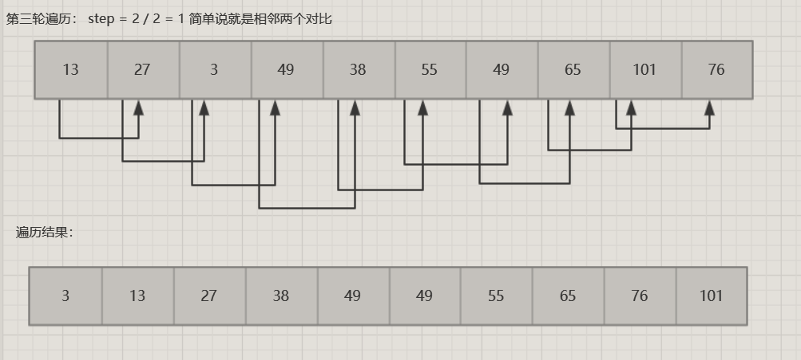

### 杂谈
#### vue配置
   1. vue配置相关：
      * mock模拟数据使用配置：
          - install mock
          - build/dev.conf.js 文件中配置引入:<br>

          ```
            require('webpack-api-mocker');
            var devWebpackConfig = {
              devServer: {
                before(app) {
                  //配置mock模拟数据加载，添加mock数据path;
                  if (process.env.MOCK) {
                    mockApi(app, path.resolve('mock/index.js'));
                  }
                },
              }
            }
          ```
          - package.json 文件中配置mock命令:

          ```
              "mock": "cross-env MOCK=true NODE_ENV=development webpack-dev-server --inline --progress --config build/webpack.dev.conf.js",
          ```

      * http请求设置:
          - 测试环境请求接口设置:
               + config/dev.env.js添加：

                ```
                  module.exports = merge(prodEnv, {
                    NODE_ENV: '"development"',
                    API_ROOT: '"http://"', //配置http请求头
                  })
                ```

               + config/index.js 配置：

                ```
                  dev: {
                     proxyTable: {
                         //设置代理,连接后台地址
                        '/api': {
                            target: , // 目标接口
                            pathRewrite: { '^/api': '' }, // 替换标识符
                        },
                    },
                  }
                ```

               + 使用axios请求数据：设置默认:axios.defaults.baseURL
          - axios请求拦截：设置请求接口,可以在axios请求时，拦截请求修改；
              + 在config/dev.env.js中配置完接口后
              + 设置：

                ```
                  //设置axios 拦截配置
                  var root = process.env.API_ROOT;
                  axios.interceptors.request.use((config) => {
                     //请求之前重新拼装url
                     config.url = root + config.url;
                       return config;
                  })
                ```

   2. vue-router的钩子函数：beforeEach&&afterEach
       * 三大钩子：
           - 全局钩子
           - 某个路由的钩子
           - 组件内部
       * 两大函数
           - Vue.beforeEach((to,from,next)=>{}) //跳转前执行
                三个参数：
                  1. to:即将跳转到的路由对象
                  2. from: 即将离开的路由对象
                  3. next: function,管道钩子，
           - Vue.afterEach((to,from)=>{}) //跳转后执行
                参数同上
        1. 全局钩子函数：定义在全局中，作用于全局；

          ```
          router.beforeEach((to,from,next)=>{
              next()
          })
          ```

        2. 某一个路由的钩子函数：写在某一路由中的函数

          ```
          const route = new VueRouter({
            routes: [{
              path: "/index",
              component: Home,
              beforeEnter: (to,from,next)=>{ //跳转之前的事件
                next();
              },
              beforeLeave: (to,from,next) => {//跳转后的事件
                next();
              }
            }]
          })
          ```
        3. 路由组件的钩子

          *路由组件属于组件，组件不等于路由组件，路由组件是在router中component处的组件，和methods同级*

          ```
          router.js
              import search from '@/search'
              routes: [{
                path: '/search',
                component: search //此时的search就是个路由组件
              }]
          search.js:
              beforeEnter:(to,from,next) => {
                next();
              }
          ```
#### ES6
  1. 简单项目编译环境配置
    1. 跳转到当前项目目录下 npm init -y 创建一个package.json文件
    2. npm install @babel/core @babel/cli @babel/preset-env  安装依赖
    3. package.json 同级目录下新建.babelrc文件配置：
   ```
      {
        "presets": [
          "@babel/preset-env"
        ]
      }
   ```
  2. 基础语法：
    1. let,const,和var
      let,const,var 都是定义变量的一种方式
      区别：
        1. let:
            * let定义的变量只作用于对应的代码块

              ```
              for(let i = 0;i<10;i++){  //父作用域
                let i = 'x' //for循环内部是子作用域
                console.log(i) //输出x
              }
              console.log(i) //此处报错 i is undefined
              ```
            * let不存在变量提升，所声明的变量必须在声明后使用
            * 暂时性死区
              暂时性死区： 在代码块内部，凡是存在使用let声明的变量，在let未声明该变量前，该变量均不可用

              ```
                var abc="123"
                if(true) {
                  abc += "str" //报错 ReferenceError
                  let abc="one";
                }
              ```
            * 同一代码块内，不允许重复声明
        2. const:一个只读的常量，声明后不可更改
            * 一旦声明必须赋值
            * 只在对应的代码块中有效
            * 不存在变量提升，同样具有暂时性死区
            * 不可重复声明
    2. 解构赋值：es6可以按照一定模式，从数组和对象中提取值，为变量赋值,可指定默认值
        1. 模式匹配：只要等号两边模式相同，左边的值就会被赋予对应的值<br>
            *等号右边需要的是可遍历的结构*
            * 数组：

                    let [a,b,c] = [1,2,3]
                    console.log(a,b,c) //1,2,3

                    let [first,] = ['john','An']
                    first: 'john'

                    let [v,[ix,ij],m] = ['one',['ji','str'],'if']
                    ix: 'ji'

            * 对象：
                内部机制：遍历对象找到对应的属性名，再将属性对应的属性值赋值给变量
                * 对象的解构要求：变量必须和属性名相同，才能取到正确的值

                  ```
                    let {a,b} = {a:'01',c:'03'} // 变相等于let {a:a , b:b} = {a: '01',b: '02'}
                    a: '01'
                    b: 'undefined'
                  ```
                 * 当变量名和属性名不同时：

                    ```
                       let {a:ia,b:ib} = {a:'01',b:'02'}
                       ia: '01'
                       ib: '02'
                    ```
            * 函数

                    function arr([x='one',y='two']) {
                      return x+y
                    }
                    console.log(arr(['str',])) //'strtwo'
        2. 用途
            * 交换变量的值
            * 从函数返回多个值
            * 函数参数的定义
            * 提取json数据
            * 函数参数默认值
            * Map遍历

                    const map = new Map()
                    map.set('first','one')
                    map.set('last','two')
                    for(let [key,value] of map ){
                      console.log(key,value)
                    }
            * 输入模块指定方法
    3. 字符串扩展
        1. 模板字符串(template string)
              * 在平常的js中输出模板：

                    var str ="this is a quertion about <b>"+text+"</b>"
                    $('#code').append(str)
              * 现在可以使用模板字符串方式：

                    $('#code').append(`
                      this is a quertion about <b>${text}</b>
                      for what
                    `)
              1. 使用反引号(`)进行标识，可以当作普通字符串使用，也可定义多行字符串，或在字符串中增加变量
              2. 使用反引号进行标志，如果在模板字符中需要使用反引号，需要使用反斜杠转义

                let str = `\'UR'\, Hello`;
              3. 定义多行字符串，会保留空格和换行，可以使用trim()去除
              4. 字符串中嵌入变量，需要将变量名写在${}中，大括号中可以放入表达式或调用函数

                    let ix ="Hello";
                    let ih ="World";
                    $("#content").append(`
                      ${ix + ih}
                    `)
              5. 模板可嵌套

                    const arr = ["红与黑","巴黎圣母院","悲惨世界","吉屋出租","真假公主"]
                    let templat = `
                      <ul>
                          ${arr.map((item)=>{
                             return `<li>${item}</li>`
                            }
                          )}
                      </ul>
                    `
                    $("#content").append(templat)
         2. 新增实例方法
              1. includes(),startsWith(),endWith()用来判定某一字符串是否包含在另一字符中,返回的都是Boolearn类型
                * includes 表示是否找到参数字符串
                * startsWith 表示参数字符串是否在字符串部
                * endWidth 表示参数字符串是否在字符串尾部

                    ```
                      {
                        let str = "Hello world!"
                        console.log('includes',str.includes('H')) //includes true
                        console.log('startsWith',str.includes('Hello')) //startsWith true
                        console.log('endWidth',str.includes('P')) //endWidth false
                        console.log('endWidth',str.includes('!')) //endWidth true
                      }
                    ```

#### other
  1. arr.lastIndexOf() 和 arr.indexOf()
    lastIndexOf(): 从数组末尾开始找起
    indexOf(): 从数组开端找起
  2. >>> 有符号位移符和 >>无符号位移符

#### 斐波那契数列
  1. 什么是斐波那契数列
    斐波那契数列： 又称黄金分割数列，以兔子繁殖引入的数列，具体大概是: 1,1,2,3,5,8,....定义的递归方法为:
      F(1) = 1,F(0) = 0, F(2) = F(1)+F(0) = 1....,以1和0开始即F(N) = F(N-1)+F(N-2),(N>2);从第三项开始每项都等于前两项之和。
  2. 题目：
    给定N,计算F(N),根据上面可以看到式子，第一眼就考虑到了使用递归的方法，
    js:
      1. 递归方法：

      ```
        var fib = function(N) {
          if(N == 0 || N == 1){
            let i = N == 1? 1:0;
            return i
          }
           return fib(N-1)+fib(N-2)
        };
      但是其实还有非递归的方法，暂时还没有想，而且看题目下的评论，说是使用动态规划，但是目前还不是很了解动态规划是什么东西，下次了解了再补充吧
      ```

#### css相关：
  1. 文字换行及省略(less)：

          .ellipsis() {
            overflow: hidden;
            white-space: nowrap;
            text-overflow: ellipsis;
          }
          .multi-ellipsis(@lines) {
            overflow: hidden;
            text-overflow: ellipsis;
            display: -webkit-box;
            -webkit-line-clamp: @lines;
            -webkit-box-orient: vertical;
          }
  2. css-shape布局： css-shape布局实现不同的文字环绕效果，和浮动配合使用
    1. 基本属性：
        * shape-outside //文本围在图形外面
        * shape-margin //形状与文字的外部距离
        * shape-image-threshold      //适用于从外部图像中获取形状，设置阈值。即设置文字覆盖到图片的什么位置
    2. shape-outside:
        1. 基本值：
          * none: 默认值
          * shape-box: 图形盒子
          * basic-shape： 基本图形函数（circle...）;
          * image: 图像
          1. shape-box: 设置文字环绕以盒子的哪个边界进行计算
              * margin-box
              * padding-box
              * border-box
              * content-box
          2. basic-shape 基本图形函数
              * circle() 绘圆函数,params: 50%|50px
                - 基本用法： params: 10%|20px
                - 其他：
                  params:[radius(半径比例) at position（圆心位置）]可选
                  例子： shape-outside: circle(5px at 50% 50%);
              * ellipse() 绘制椭圆
                - 基本用法： params: 10%|20px
                - 其他：
                  params:[ radius[x,y]（半径比例) at position（圆心位置）]可选
                  例子： shape-outside: ellipse(10% 20% at 50% 50%);
              * inset() 绘制一个矩形,params:(距离上下，左右的距离，[round]可选，定义矩形每个角的圆滑程度)
                例子： shape-outside: inset(20px 10px round 10%);
              * polygon() 多边形绘制,params: fill-rule 填充规则（可选），[水平位移，垂直位移]（可多个）
                例子： shape-outside: polygon(40% 0, 100% 0,50% 50%);
          3. image: url() 引入图片路径
  3. grid布局：网格布局，与flex感觉类似，但是比flex更加强大
    1. 基本使用：在容器上设置属性
      容器： display: grid
      *容器使用grid后，子元素float,display属性失效*
    2. 基本属性
        1. 容器：
            1. grid-template-columns： 设置子元素竖向排列
                + 基本值： 每一列元素所占大小
                + 函数repeat(): 当需要设置的子元素过多时，可使用repeat重复函数，
                    parmas(需要重复的次数,需要重复的数值|模式)
                + 函数minmax(): 设定一个范围值，params(min,max);表示 min<colWidth<max;
                + 关键字fr: 每一列所占比例，有点类似flex:1;的设置
                + 关键字auto-fill: 用于容器宽度不确定，但是子元素宽度确定的情况下设置，用于在容器放置尽可能多的子元素
                  例子：  grid-template-columns: repeat(auto-fill, 100px);
                + 关键字auto:这个大概不需要解释，浏览器自己决定列宽
            2. grid-template-rows: 子元素横向排列
            3. grid-gap: (row,col | all)每个子元素之间的间隔
                1. grid-col-gap: 列间距
                2. grid-row-gap: 行间距
            4. grid-template-area: 在容器内设置指定区域，区域由一个或多个单元格组成,
                配合子元素的属性grid-area使用
            5. grid-auto-flow: 划分好网格后，子元素什么顺序放置
                default: row （先行后列）
                other: col（先列后行） | row dense (当某一个元素指定位置后，剩下的元素按照先行后列顺序排列，并尽可能紧密排列) | column dense
            6. grid-auto-column,grid-auto-row: 当子元素的指定位置在现有网格的外部，会自动生成多余网格放置子元素，这两个属性是用来设置多余网格的列宽和行宽
        2. 子元素：
            1. grid-area: (areaName | row-start（元素从哪个列分割线开始放置） /  col-start / row-end / col-end )用以指定对应的子元素放置在哪个区域
            例子： grid-area: a;
              grid-area: 1 / 1 / 3 / 3 ; 展示效果如下：
              
            2. grid-column-start,grid-column-end,grid-row-start,grid-row-end: 用来指定子元素放置的位置,确定用来定位在哪个网格线
            3. grid-column: start / end
               grid-row: start / end
               是第二条的合并简写
  4. clip-path: 剪裁属性,对元素进行剪裁，只展示部分
    1. 基本属性：
        1. none
        2. <basic-shape> 图形函数：
            1. inset(): 绘制一个矩形，params(距离四个边框的距离 ? <font color ="red"> round </font> [border-radius])；
            2. circle(): 绘制一个圆，params(radius ? <font color="red">at</font> position);
              例子： clip-path: circle(80px at 50% 50%);
            3. ellipse(): 绘制一个椭圆，params(x-radius y-radius ? <font color="red"> at </font> position)
              例子： clip-path: ellipse( 90px 50px at 50% 50%);
            4. polygon(): 绘制一个多边形,params(剪切规则(剪切图形各个顶点坐标)),可以利用在线的clip-path生成器
              例子： clip-path: polygon(50% 0%,0 100%,100% 100%) //三角形
        3. <geometry-box>: 生成图形所依据的盒子模型属性
            1. margin-box
            2. padding-box
            3. border-box
            4. content-box
            5. fill-box: 对象边界
            6. stroke-box: 笔触边界
            7. view-box: 最近的svg视口为引用框
  5. css背景合成，混合：
  6. line-height:
      line-height 是行高
       * line-height: 10px
       * line-height: 1.5 : 设置的字体大小的1.5倍
       * line-height: 150%: 设置的字体大小的150%

#### vue中使用qrCode生成二维码
  1. npm install qrcodejs2
  2. 页面中引入qrcode;

          import QRCode from 'qrcodejs2'
          new QRCode(id,{
            text: '' //二维码内容
            //render: 'canvas' // 设置渲染方式（有两种方式 table和canvas，默认是canvas）
            colorDark: '#000000',
            colorLight: '#ffffff',
            width: 95,
            height: 95,
          })
  3. 关于微信扫描二维码扫不出来的问题：设置二维码容错等级
      correctLevel: QRCode.CorrectLevel.L

#### 写一个色值深浅排序方法
  核心：var grayLevel = r*0.299 + g*0.587 + b*0.114; 根据当前颜色的灰度判断颜色深浅。
##### 步骤一： 转换色值为rgb格式
  1. **hex2rgb: hex格式是16进制,转换为rgb其实就是16进制转换为10进制，较为简单。**
    ``` javascript
        function hex2rgb(color) {
          color = color.slice(1);
          var rgb = "";
          for(var i = 0; i < color.length; i += 2 ) {
            var end = i+2
            rgb += parseInt(color.slice(i, end), 16).toString()+",";
          }
          rgb = rgb.slice(0, rgb.length-1)
          rgb = "rgb("+rgb+")"
          return rgb;
        }
    ```

  2. **hel2rgb: hel格式似乎前端不怎么用的样子， 格式 ：hsl(208, 0.36, 0.39)**
     h: hue(色相) 在带有色相角度的值域里[0, 360]中对应的色相角度。
     s: Saturation (饱和度)
     l: Lightness (亮度)

     基本步骤：
     1. 转换h,s,light为[0-1]中的值。
     2. if (s == 0) ==> r,g,b = light; 表明此时颜色是非彩色，或灰色的；
     3. 否则， 根据light判断,  temp2 = light < 0.5 ? light * (1ight + s) : light + s - light * s;
     4. temp1 = 2 * light - temp2;
     5. 获取r,g, b
        r = h + 1/3;
        g = h;
        b = h - 1/3;
     6. 对rgb进行判断；
    ``` javascript
        function getMid(str) {
          var left = str.indexOf('(')+1;
          var right = str.indexOf(')');
          return str.slice(left, right);
        }
        function hel2rgb(color) {
          var arr = getMid(color).split(',');
          var r, g, b;
          var h = toNum((arr[0] / 360)+'' ), s = toNum(arr[1]), light = toNum(arr[2]); // h(色相) s(饱和度) l(亮度)
          var temp2, temp1;
          if (s == 0) {
            r = g = b = light;
          } else {
            temp2 = light < 0.5 ? light * (1 + s) : light + s - light * s;
            temp1 = 2 * light - temp2;

            var h2rgb = function(p, q, t) {
              if (t < 0) t += 1;
              if (t > 1) t -= 1;
              if (t < 1/6) return p + (q - p) * 6 * t;
              if (t < 1/2) return q;
              if (t < 2/3) return p + (q - p) * (2/3 - t) * 6;
              return p
            }
            r = h2rgb(temp1, temp2, h + 1/3);
            g = h2rgb(temp1, temp2, h);
            b = h2rgb(temp1, temp2, h - 1/3);
          }
          return  "rgb(" + Math.round(r * 255) + ',' + Math.round(g * 255) + ',' + Math.round(b * 255)+')';
        }
        function toNum(str) {
          var rex = /[0-9A-F]+/g;
          if(str.indexOf('%') > 0) {
              return (str.match(rex)[0]) / 100;
          } else {
            if(typeof(+str) === "number") {
              return +str;
            }
          }
        }
    ```

##### 步骤二： 获取颜色灰色值：
  之前已经将颜色转换为rgb,通过核心公式获取颜色灰度值，从而进行判断。
  ``` javascript
    function isRgb(color) {
      return /^rgb/.test(color)
    }
    function isHex(color) {
      return /(^#[0-9A-F]{6}$)|(^#[0-9A-F]{3}$)/i.test(color)
    }
    function isHsl(color) {
      return /^hsl/.test(color);
    }
    function grayLevel (color) {
      color = isRgb(color)
        ? color
        : isHex(color)
          ? hextoRgb(color)
          : hslToRgb(color);
      var arr = getMid(color).split(',')
      var r = arr[0], g = arr[1], b = arr[2];
      return r*0.299 + g*0.587 + b*0.114
    }
  ```

##### 步骤三： 排序
  ```javascript
    function sortColor(colors) {
      return  colors.sort(function(a, b){
        return grayLevel(b) - grayLevel(a)
      })
    }

    //调用
    var color = ['rgb(255,153,153)', 'rgb(246,162,144)', 'rgb(236,172,134)', 'rgb(227,181,125)', 'rgb(218,190,116)', 'rgb(209,199,107)', 'rgb(199,209,97)', 'rgb(190,218,88)', 'rgb(181,227,79)', 'rgb(172,236,70)', 'rgb(162,246,60)']
    var result = sortColor(color)
    var div = ''
    for(; i < color.length ; i++) {
     div += '<div style="width: 100px; height: 50px; background: '+result[i]+'">'+result[i]+'</div>'
    }
    $('.main').append(div);
  ```

#### 其他
  1. 字符串逃逸： 字符实体, 转义字符
  2. 节流 && 防抖 ？？？ throttle debounce
    解决请求和响应速度不匹配问题（涉及连续事件和频率控制相关应用需考虑）
    节流： 在某一段时间内，即使多次触发事件，也只会执行一次。
  3. 数字之间的下划线连接：
     ```
      1_2_3 === 123;
      typeof 1_2_3 == "number";
      数字之间的下划线连接，不影响真替数据，只是为了更好的可看性，无实际意义。
      注意： 只有在数字中间的下划线才可以，下划线不可以放在开头or结尾
     ```

  4. vue中data修改但是页面未更新
    data中数组改变，但是页面状态未更新
  5. sublime Text下markDown Editing编辑主题修改无效问题：
     * ctrl + shift + p
     * 输入 Preferencrs: MarkdownEditing Settings - User 回车打开对应文件
     * 在文件中添加：
        {"color_scheme": "Packages/Theme - Cyanide/Cyanide - Contrasted Light.tmTheme",}，修改为自己需要的主题，保存。
     * 如果再次打开文件发现无效，请确认当前文件模板是否正确，
     * 右下角选择将当前的扩展名所有文件保存为Markdown GFM(这个是由于我本地设置，具体需要保存为什么类型，主要看自己的需要)

#### 哦，算法
##### 快速排序（二分法排序？）
  快速排序（二分法排序），简单来说，就是将数据对半切割，将数据依次与中间数值进行对比，分为左右两个部分，递归遍历。
  原理：
    1. 获取数组中间长度的数值mid,遍历数组中的值与mid进行对比，比mid小的放在左边，大的放右边，最后将左右两部分合并
    2. 递归上一操作，直至数据长度为1.

  ```javascript
    function quickSort(arr) {
      if (arr.length <= 1) return arr;
      var midIndex = Math.floor(arr.length / 2);
      var mid = arr.split(midIndex, 1)[0];
      var left = right = [];
      var i = 0;
      while(i<arr.length) {
        var target = arr[i];
        if (target <= mid) {
          left.push(target);
        } else {
          right.push(target);
        }
      }
      return quickSort(left).concat([mid], quickSort(right))
    }
  ```
  二分法数据查找： 利用二分法进行快速查找，一般用于有序数组。
  原理：
    1. 设置start,end,遍历数据，获取中间值，如果中间值大于目标值，修改start = 中间值下标, 否则修改end;
    2. 遍历数据，直到中间值与目标值相等
  javascript代码实现：
  ```javascript
    function quickFind(nums, k) {
      var start = 0, end = nums.length;
      var index = 0
      while(start < end) {
        index++;
        var midIndex = Math.floor( start + ( end-start )/ 2);
        var mid = nums[midIndex];
        if (mid == k) {
          return midIndex
        } else if (mid > k) {
          end = midIndex;
        } else if (k > mid) {
          start = midIndex;
        }
      }
    }
  ```
##### 冒泡排序
  冒泡排序： 依次比较数据相邻的两个，顺序错误则两个交换，最终，比较大的数据会慢慢浮出到顶端，像泡泡一样冒出。
  ```javascript
    function popSoft(arr) {
      for(var i = 0; i < arr.length; i++) {
        for(var j = 0; j < arr.length - 1; j++) {
         if (arr[i] > arr[j]) {
           var temp = arr[j];
           arr[j] = arr[i];
           arr[i] = temp;
         }
        }
      }
      return arr;
    }
  ```
##### 洗牌算法
  洗牌算法：顾名思义,像洗牌一样随机抽取数组中的数据，与当前所在数据进行交换，一般用于数据的乱序排列
  js实现代码：
  ```javascript
    function random(arr) {
      var len = arr.length;
      for (var i = 0; i < len; i++) {
        var nextIndex = Math.floor(Math.random() * (len))
        var preValue = arr[i];
        arr[i] = arr[nextIndex];
        arr[nextIndex] = preValue;
      }
      return data
    }
  ```

##### 希尔排序
  希尔排序：递减增量排序方法，对我的理解来说，将数据多次对半切割，获取步长，每次相等步长的两个数据进行对比，交换，直至步长为1。
  ```
      例子：
          [49,38,65,101,76,13,27,49,55,1]
        1轮 ： step == 5
        交换流程： 49 <------> 13  arr[0] <----> arr[5]
                  38 <------> 27  arr[1] <----> arr[6]
                  65 <------> 49  arr[2] <----> arr[7]
                  101<------> 55  arr[3] <----> arr[8]
                  76 <------> 1   arr[4] <----> arr[9]
        交换结果： [13,27,49,55,1,49,38,65,101,76]
  ```
  图例：
  ```
        2轮： step == 5 / 2 = 2
        流程：     13 <----> 49  arr[0] <-----> arr[2]
                  27 <----> 55  arr[1] <-----> arr[3]
                  49 <----> 1   arr[2] <-----> arr[4]
                  55 <----> 49  arr[3] <-----> arr[5]
                  49 <----> 38  arr[4] <-----> arr[6]
                  49 <----> 65  arr[5] <-----> arr[7]
                  49 <----> 101 arr[6] <-----> arr[8]
                  65 <----> 76  arr[7] <-----> arr[9]
        交换结果： [13, 27, 3, 49, 38, 55, 49, 65, 101, 76]
  ```
  图例： 
  ```
        3轮： step = 2 / 2 =1 这时就是相邻两个数值交换了
        结果： [1,13,27,38,49,49,55,65,76,101]

  ```
  图例： 

  js实现代码:
  ``` javascript
    function shell_sort(data){
      var len = data.length;
      for(var dep = Math.floor(len / 2); dep > 0 ;  dep = Math.floor(dep / 2)){
        // console.log(dep)
        for(var i = dep; i < data.length; i++) {
          for(var j = i-dep; j >=0; j-=dep){
            if(data[j] > data[j + dep]) {
              var temp = data[j + dep];
              data[j+dep] = data[j];
              data[j] = temp;
            }
          }
        }
        // console.log(data)
      }
      return data
    }
  ```

##### 归并排序
  归并排序： 简单说，就是将一组数据根据序列划分越来越小的半序列，然后再将半序列进行排序，最后利用递归的方式将排好顺序的半序列进行合并，最终返回
  基本原理：
     1.  将数组分为左右两部分 ，此时序列 2
     2.  在将左右两部分依次再划分出左右， 此时序列 4
     3.  再次进行递归划分，直至每部分的数据长度为1，
     4.  左右序列进行排序后合并
#### React
##### create-react-app 中npm run eject报错问题
  在npm run eject前应确保文件中没有可提交的内容；
  产生报错：
  npm run eject Remove untracked files, stash or commit any changes, and try again
  解决：
    跳转到当前项目文件目录下：
    git init
    git add .
    git commit -m "saving before ejecting"
    npm run eject